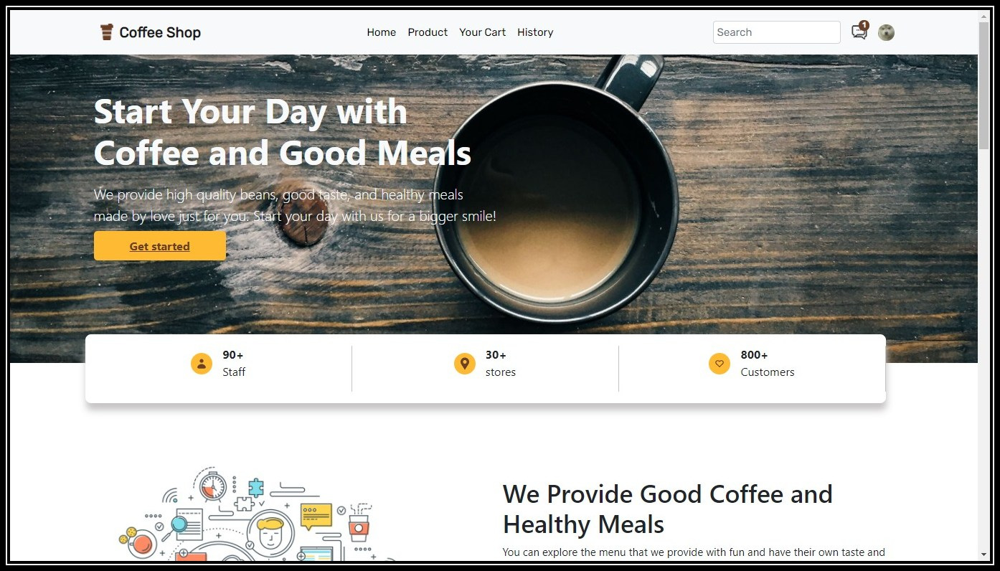
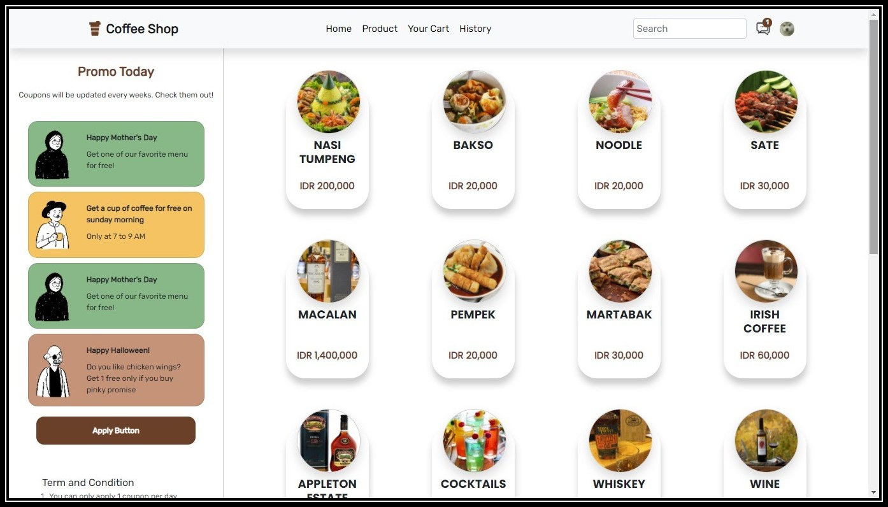
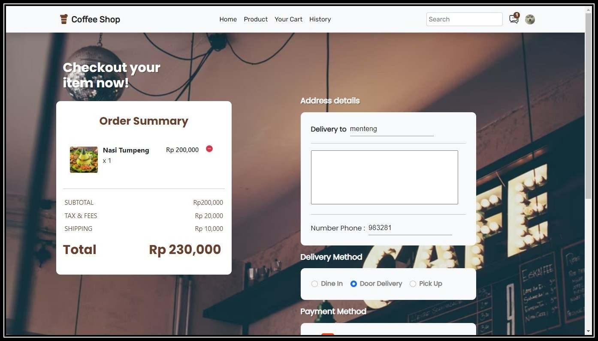
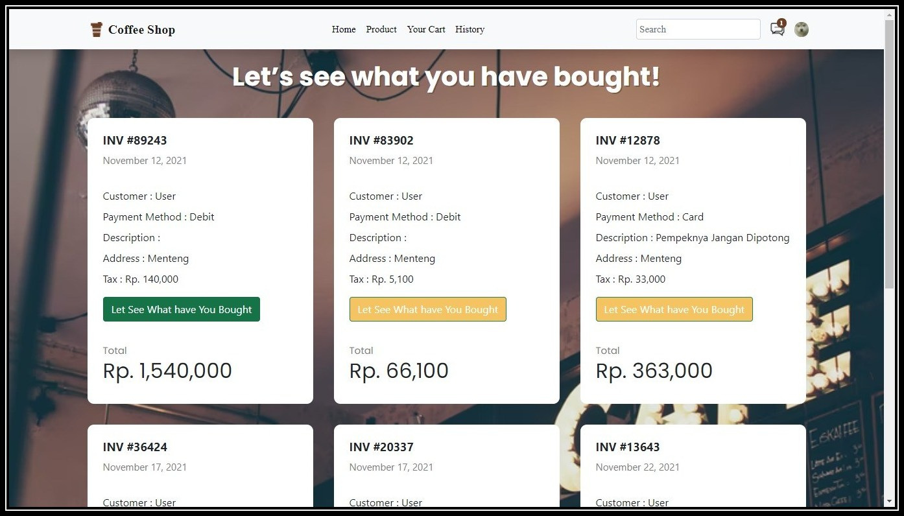

<div id="top"></div>

<!-- PROJECT LOGO -->
<br />
<div align="center">
  <a href="https://github.com/figoysra/week20.git">
    
  </a>

<h3 align="center">COFFEE SHOP</h3>

  <p align="center">
    React JS COFFEE SHOP App
    <br />
    <a href="https://github.com/figoysra/week20Repo.git"><strong>Explore API »</strong></a>
    <br />
    ·
    <a href="https://github.com/figoysra/week20/issues">Report Bug</a>
    ·
    <a href="https://gocoffeeshop.netlify.app/">Live Demo</a>
    ·
    <a href="https://github.com/figoysra/week20/issues">Request Feature</a>
  </p>
</div>


<!-- TABLE OF CONTENTS -->
<details>
  <summary>Table of Contents</summary>
  <ol>
    <li>
      <a href="#about-the-project">About The Project</a>
      <ul>
        <li><a href="#built-with">Built With</a></li>
      </ul>
    </li>
    <li>
      <a href="#getting-started">Getting Started</a>
      <ul>
        <li><a href="#installation">Installation</a></li>
      </ul>
    </li>
    <li><a href="#screenshot">Screenshot</a></li>
    <li><a href="#contact">Contact</a></li>
  </ol>
</details>


<!-- ABOUT THE PROJECT -->
## About The Project



Coffee shop is a coffee and food ordering application. this application has an admin page to
add products, edit and delete products while the user page contains transaction pages and
transaction history. This application is made using react, redux on the front end and express, node
and json web tokens for authentication and authorization, unit testing on the backend


<p align="right">(<a href="#top">back to top</a>)</p>


### Built With

* [React.js](https://reactjs.org/)
* [Redux](https://redux.js.org/)
* [Reactstrap](https://reactstrap.github.io/)
* [Bootstrap](https://getbootstrap.com/)
* [MUI](https://mui.com/)
* [Axios](https://www.npmjs.com/package/axios)


<p align="right">(<a href="#top">back to top</a>)</p>


<!-- GETTING STARTED -->
## Getting Started

**Login as Admin** </br>
Email : admin@email.com </br>
Password : 12345 </br>

**Login as User** </br>
Email : user@email.com </br>
Password : 12345


### Installation

1. Clone the repo
   ```sh
   git clone https://github.com/figoysra/week20.git
   ```
2. Install NPM packages
   ```sh
   npm install
   ```
3. Start the Application
   ```js
   npm start;
   ```

<p align="right">(<a href="#top">back to top</a>)</p>


<!-- ROADMAP -->
## Screenshot

**USER INTERFACE**

Landing Page        |  Products
:-------------------------:|:-------------------------:
  |  

Check Out          |  History Page
:-------------------------:|:-------------------------:
  |  

**ADMIN INTERFACE**
Landing Page        |  Add Product
:-------------------------:|:-------------------------:
.png)  |  .png)

Detail Product         |  Edit Product
:-------------------------:|:-------------------------:
.png)  |  .png)


<p align="right">(<a href="#top">back to top</a>)</p>


<!-- CONTACT -->
## Contact

Figo Yusra  - [@instagram](https://www.instagram.com/figoyusra/) - figoyusra.133@gmail.com


<p align="right">(<a href="#top">back to top</a>)</p>

